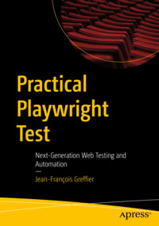

# Practical Playwright Test
***Next-Generation Web Testing and Automation***

This repository accompanies [Practical Playwright Test](https://link.springer.com/book/9798868821592) by Jean-François Greffier (Apress, 2026)

## About the book
Gain cutting-edge skills in crafting reliable, efficient end-to-end tests with Playwright Test. This book is your comprehensive guide to Playwright Test that will help you to create and debug blazing fast tests, and integrate and customize Playwright Test to fit your testing needs. 

The book begins with an introduction to Playwright and teaches you the fundamentals of how to write tests efficiently. The book then gets into concepts like Locators and explains how to set up a CI using Playwright Test. After this, you will gain experience in two important aspects of testing – speed and customization. You will then be taken through a deep dive into Fixtures followed by an exploration of strategies like mocking and emulation through which you can achieve more control of the testing environment. The book also provides a detailed discussion on flakiness and how Playwright Test can help you with it. It then teaches you how to automate tests and ends with a discussion on how Playwright Test changes the landscape of testing, and how to integrate it in your daily practices and testing strategy.

By reading this book, you will become an expert in the specificities of Playwright Test and how to test critical user flows, reduce bugs in production, and ultimately ship reliable software with confidence.

### What You Will Learn
- Create and debug reliable end-to-end tests efficiently with the perfect locators
- Set up a CI using Playwright Test to get results, test reports and useful traces
- Understand how to use and write Fixtures
- Customize Playwright to fit your needs

### Who This Book Is For
Frontend developers, full-stack developers, QA Engineers, Software Testers, Test Automation Engineers, QA Leads and QA Managers
